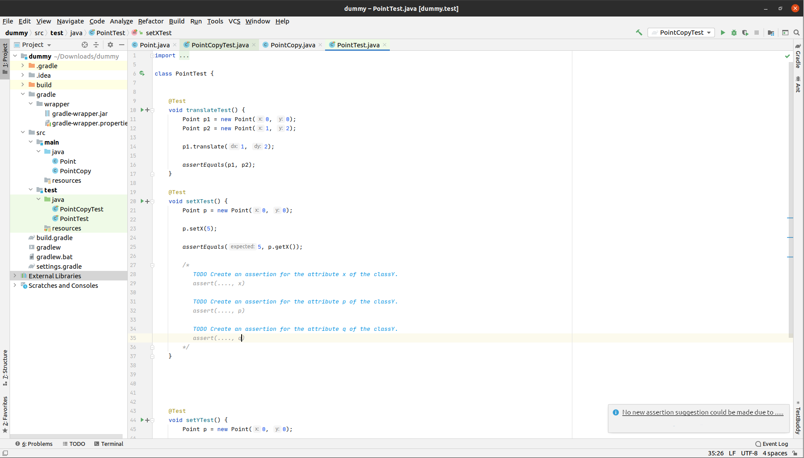

# Description of the Assertion Suggestions mockup

- The user can request a list of assertion suggestions for a specific test case by pressing a button near the method name.
    - Currently, the icon in the mockup is a "+" icon, but it is just a placeholder.
- This action can also be called by a keyboard hotkey on the code the text cursor currently points to.
- If no assertion suggestion can be made for any reason, a message can pop up in the form of a balloon.
- The list of the assertions suggestions will look like in the following at the bottom of the test case:
```
/*
   TODO Create an assertion for the attribute x of the classY.
   assert(...., x)
   
   TODO Create an assertion for the attribute x of the classY.
   assert(...., x)
   
   TODO Create an assertion for the attribute x of the classY.
   assert(...., x)
*/
```
- Using this approach, It is easy for the user to copy the snippet code.

# Graphical mockup
### Editor view

