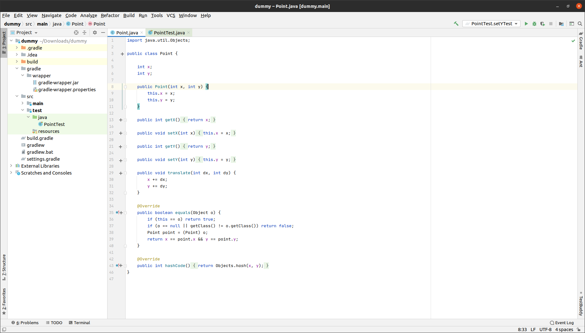
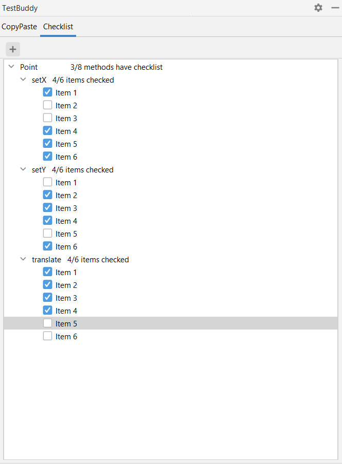

# Description of the Checklist mockup

- We will have the checklist tree following this hierarchy:
``` 
> class 1
  > method 1
     > Item 1 
     > Item 2
     > Item 3 
  > method 2
     > Item 1 
     > Item 2
     > Item 3
     > Item 4
> class 2
  > method 1
     > Item 1 
     > Item 2
     > Item 3 
```

- For each method we will have a button which will create checklist for that method. Visually, the tree will be updated and the new method checklist items will be expanded (visible without manually pressing the button for expanding the tree).
- For each class we will have a button which will create checklist for that class. Visually, the tree will be updated and the new class and its methods checklist items will be expanded (visible without manually pressing the button for expanding the tree).
- Adding new method and class checklists can also be accessed by right clicking on the method/class on the code editor in addition to the button.
- Near each method, we will have a label which will tell the user how many items of that specific method have been checked (i.e. "6 of 9 items checked")
- Near each class, we will have a label which will tells the user how many methods checklists have been generated for that specific class (i.e. "6 of 9 methods has checklist")
- The number of checked item per method will have a text color to indicate how many checklist items have been checked.
- In the future, the checklist will be dynamically refreshed but it can also be manually refreshed.
- If the user wants to generate the checklist for an existing class/existing method, the Toolwindow UI will not create a new checklist as it already exists. Thus, we will preserve the final version and the "human mistakes" will be avoided.
- The user will be able to modify the checklist item (add/edit/remove) manually by pressing right-click on the toolwindow UI but they can only remove it for the checklist method or checklist class from the Toolwindow UI.
- The stats regarding checklist will be updated after any operation which modifies the tree.

# Graphical mockup
###Editor View

###Side Bar View



