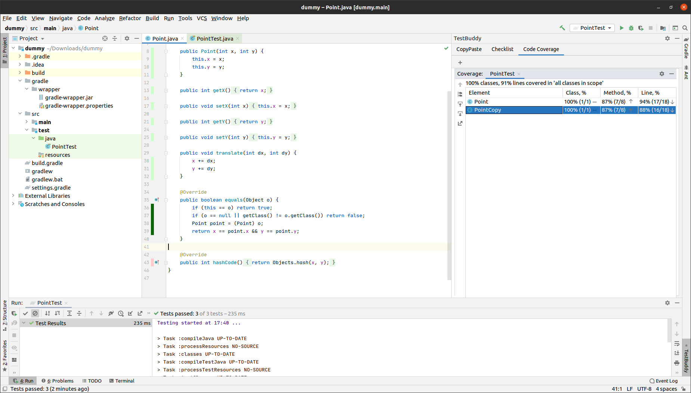
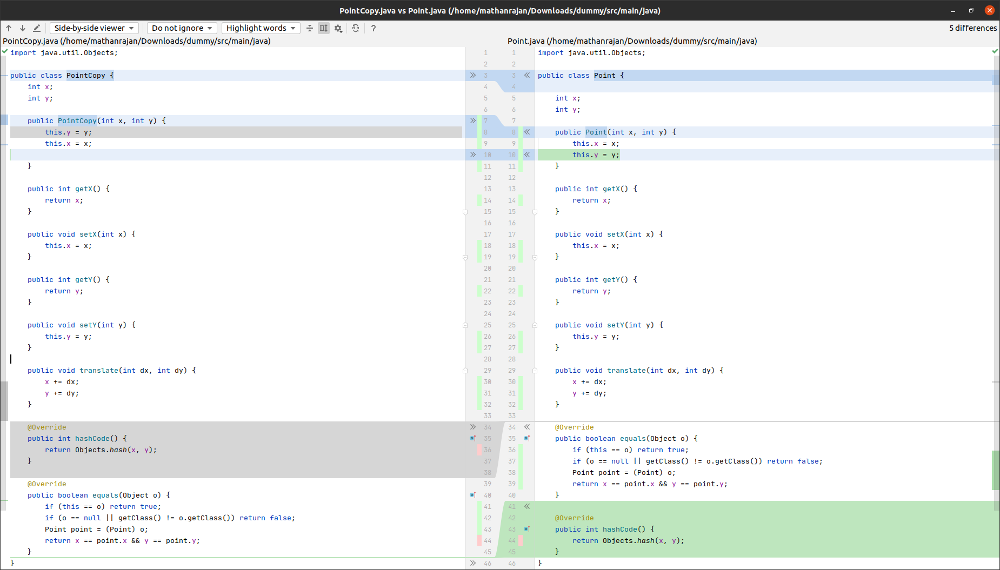

# Description of the Coverage mockup

- The Tool window will contain useful information regarding the coverage history. For example, the old and new branch coverage %.
    - The image gives a rough idea about the structure of the layout. The user can expand on a test method to see old coverage information as well.
- The main editor which contains the source code will highlight the changes in coverages.
    - The new coverage will be highlighted light green.
    - The old coverage which didn't change will be highlighted in dark green.
    - The old coverage which is no longer covered will be highlighted in red.
    - Every other case will not have any highlights.
    - This is not the final choice for the colors. The colors can be changed after considering potential issues due to  color blindness.
- The user can also request a new diff tab where the old and new coverage will be shown side by side with the usual IntelliJ coverage color scheme. Here any changes in the source code can also be shown.
    - The image shows the diff window IntelliJ uses. No modification to their UI has been made there and it already showcases all the necessary diff information.
- The user can request these information by pressing a button in the tool window or by using an action hotkey.

# Graphical mockup
###Full Window View

###Diff View
